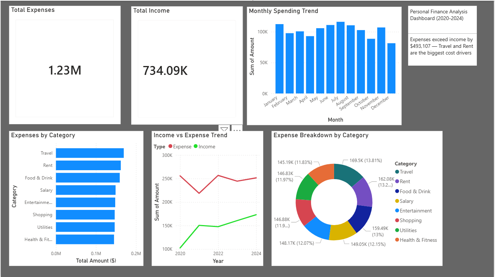

# Personal Finance Analysis Dashboard (2020-2024)

## Project Overview
This project analyses 1,500 personal finance transactions over 5 years (2020-2024) 
to uncover spending patterns and financial health insights.

## Key Findings
- Total expenses ($1.23M) exceeded total income ($734K) by $493,107 over 5 years
- Travel was the biggest expense category (13.81% of total expenses)
- Rent was the second biggest expense (13.21%)
- 2022 recorded the highest overall spending
- July consistently had the highest monthly spending

## Tools Used
- **Excel** — Data cleaning and pivot table analysis
- **SQL (SQLite)** — Database querying and insight extraction
- **Python** — Data analysis and visualisation (pandas, matplotlib, seaborn)
- **Power BI** — Interactive dashboard development

## Files in this Repository
- `Personal_Finance_Dataset.csv` — Raw dataset
- `finance_analysis.py` — Python analysis script
- `finance_queries.sql` — SQL queries used
- `Personal_Finance_Dashboard.pbix` — Power BI dashboard

## Dashboard Preview

## Key SQL Queries
Total Income vs Expense, Expenses by Category, Expenses by Year, Average Monthly Spending
